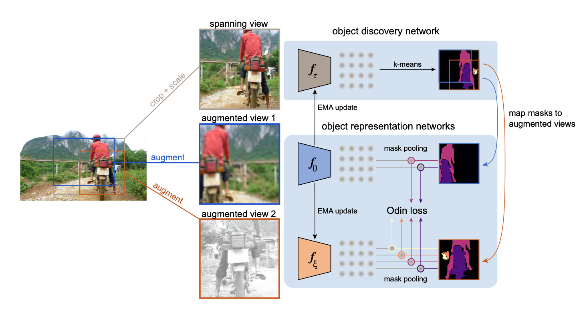

# SatelliteODIN

This repository is part of the Thesis work: Sky’s the Limit: Satellite Imagery Analysis with Image-level and Dense Self-Supervised Techniques.

## Abstract
The introduction of the Vision Transformer (ViT) has revolutionized the field of computer
vision, significantly advancing research in self-supervised learning (SSL). While SSL devel-
opments have predominantly focused on object-centric and RGB images, the application of
these methods to satellite imagery poses unique challenges due to substantial domain shifts.
This study explores the use of a plain ViT backbone for satellite image analysis as it presents
multiple advantages over its hierarchical version.
We investigated three SSL frameworks — DINO, Leopart, and ODIN — evaluating their
performance on satellite images. Our findings indicate that pretraining on satellite images
provides a substantial advantage over object-centric RGB images, underscoring the value
of domain-specific pretraining. We observed that advanced dense SSL algorithms did not
consistently outperform traditional image-level SSL frameworks, with fine-tuning results
highlighting limitations in the dense approach when adapted to a ViT backbone. Furthermore,
linear probing performance did not reliably predict fine-tuning outcomes, suggesting that
linear probing may not fully reflect real-world application performance.
Notably, the plain ViT backbone, when combined with our selected SSL frameworks, learned
powerful representations that outperformed recent benchmarks on the DFC2020 and MADOS
datasets. Future research could enhance this framework by integrating a ViT-Adapter with the
ODIN algorithm to improve object detection granularity and training efficiency. This approach
could also enable the ViT backbone to process multiple data modalities, offering promising
potential for further advancements in SSL. Additionally, integrating a Mask2Former decoder
with the ViT-Backbone for semantic segmentation could further improve performance in
instance, panoptic, and semantic segmentation, making the model more general and robust.

Full paper available upon request.

Author: *Amaudruz R.*

Supervisors: *Yuki A., Russwurm, M.*

## Acknowledgements
This project builds upon the work in the repository [detcon-pytorch](https://github.com/isaaccorley/detcon-pytorch). The original research was conducted by Olivier J. Hénaff, Skanda Koppula, Evan Shelhamer, Daniel Zoran, Andrew Jaegle, Andrew Zisserman, João Carreira, and Relja Arandjelović, as part of their study titled "[Object Discovery and Representation Networks](https://www.ecva.net/papers/eccv_2022/papers_ECCV/papers/136870121.pdf)", presented at the European Conference on Computer Vision, pages 123–143, Springer, 2022. We extend our gratitude to both the authors of the study and the owners of the detcon-pytorch repository for their contributions to the open-source community, which have provided a valuable foundation for this project.

## SSL algorithm illustration
We show an illustration of the ODIN framework, taken from [Object Discovery and Representation Networks](https://www.ecva.net/papers/eccv_2022/papers_ECCV/papers/136870121.pdf):

## Contributions
- [x] **DetCon to ODIN conversion**: We extend the original repo, which contained the DetCon framework to the ODIN framework. This involved creating the code for the Object Detection part of the ODIN network.
- [x] **Plain ViT backbone**: Instead of a Swin or ResNet backbone, we utilise a plain ViT backbone and make the necessary adjustments.
- [x] **Satellite imagery**: We make the necessary adjustments to cater for Multi-Spectral images with 13 channels.
- [x] **Visualisations**: We added some visualisations to validate that the object detection mechanism and cropping worked as intended.

## Script
- [ODIN SSL Script](https://github.com/RyanAmaudruz/SatelliteODIN/tree/main/snellius/train_odin.sh): Run ODIN SSL on satellite imagery script.

## License
This repository is released under the MIT License. The dataset and pretrained model weights are released under the CC-BY-4.0 license.
